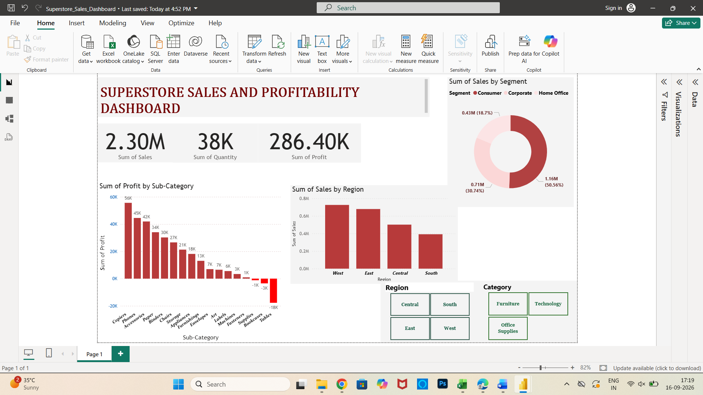

# Superstore Sales & Profitability Dashboard

## Overview
An interactive Power BI dashboard analyzing sales, profit, and quantity across the Superstore sample dataset. The dashboard is built to answer a core business question: **which regions, categories, and sub-categories drive profit — and where is the business actually losing money?**

Built entirely in Power BI Desktop, using KPI cards, bar charts, a donut chart, and interactive slicers for Region and Category.

## Tools Used
Power BI Desktop · DAX (implicit measures) · Data modeling · Conditional formatting

## How to View
- Screenshots of the dashboard are below.
- To interact with it directly (use the filters/slicers), download Superstore_Sales_Dashboard.pbix and open it in [Power BI Desktop](https://www.microsoft.com/en-us/power-platform/products/power-bi/downloads) (free, Windows only).

## Dashboard

## Key Findings
- **Total Sales: 2.30M | Total Profit: 286.40K | Total Quantity Sold: 38K** across the full dataset.
- **Consumer segment drives the majority of sales**, contributing 50.56% (1.16M) of total sales, more than Corporate (30.74%) and Home Office (18.7%) combined nearly matching each other.
- **The West region leads in sales**, followed by East, Central, and South in descending order — highlighting where demand is concentrated geographically.
- **Not all sub-categories are profitable.** While Copiers, Phones, and Accessories are the top profit drivers (56K, 45K, and 42K respectively), **Tables, Bookcases, and Supplies show negative profit** (as low as -18K for Tables) despite generating sales — indicating pricing, discounting, or cost issues in these specific sub-categories that would be worth investigating further in a real business setting.
Business Takeaway

The company could improve overall profitability without necessarily increasing sales volume, by reviewing discount strategy or cost structure specifically for Tables, Bookcases, and Supplies — the sub-categories currently dragging down profit despite contributing to revenue.
## Business Takeaway
The company could improve overall profitability without necessarily increasing sales volume, by reviewing discount strategy or cost structure specifically for Tables, Bookcases, and Supplies — the sub-categories currently dragging down profit despite contributing to revenue.# superstore-sales-dashboard
